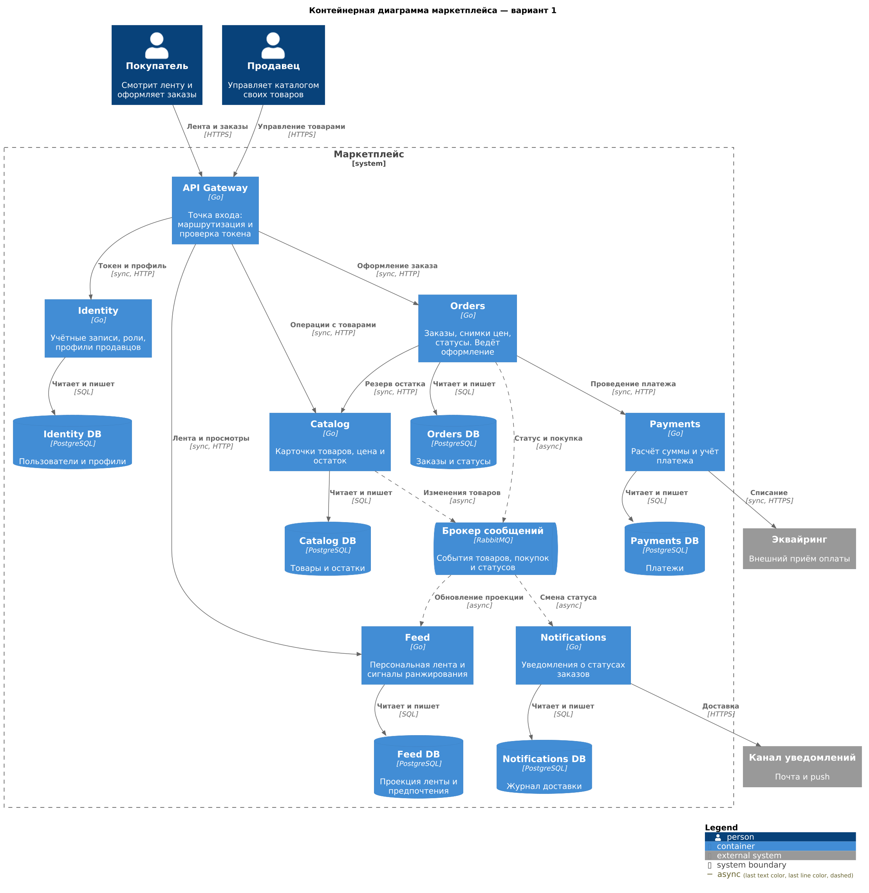
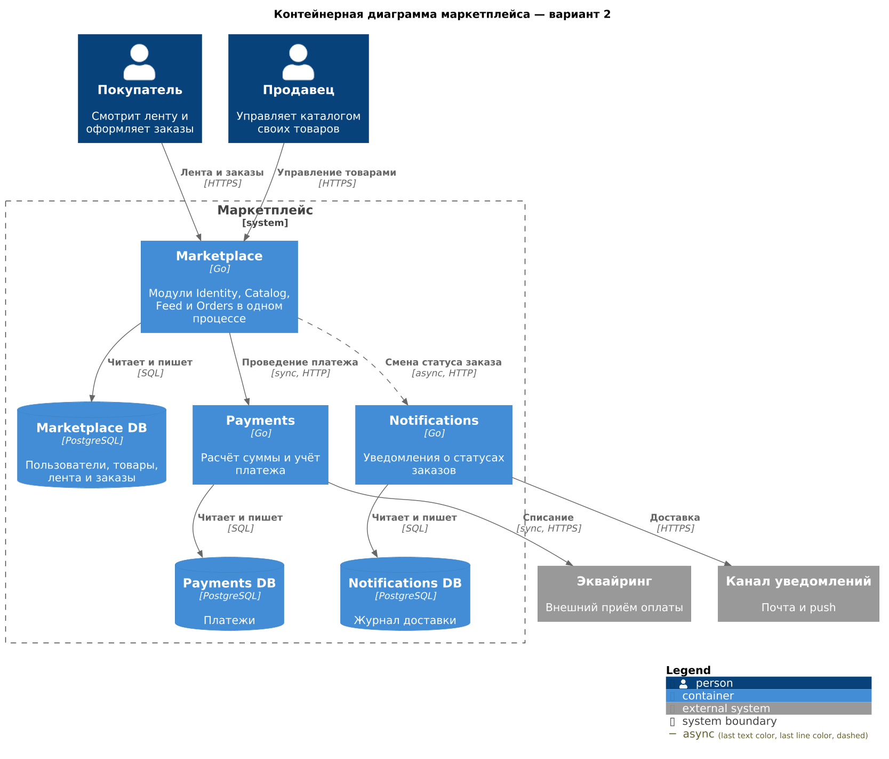

# Маркетплейс

Архитектура цифровой площадки, на которой продавцы публикуют товары, а покупатели смотрят персональную ленту и оформляют заказы. Платформа рассчитывает и учитывает платежи и отправляет уведомления о статусах заказов.

На этом этапе зафиксированы границы системы. Бизнес-логика не реализуется. Сервисы пишутся на Go. У каждого сервиса своя PostgreSQL, асинхронный обмен идёт через RabbitMQ, синхронный — по HTTP.

Выбран **вариант 1**: шесть сервисов по ограниченным контекстам. Альтернатива — **вариант 2**: три сервиса, где учётные записи, каталог, лента и заказы живут в одном процессе.

## Контекст

Покупатель и продавец работают с системой через одну точку входа.

| Роль | Что делает |
|---|---|
| Покупатель | Смотрит персональную ленту, открывает товар, оформляет заказ |
| Продавец | Создаёт и меняет карточки своих товаров, публикует и снимает их с продажи |

За границей системы две внешние зависимости.

| Внешняя система | Кто с ней говорит | Зачем |
|---|---|---|
| Эквайринг | Payments | Списание по уже посчитанному платежу |
| Канал уведомлений (почта и push) | Notifications | Доставка сообщения покупателю |

## Домены и их ответственность

Домены одинаковы для обоих вариантов. Варианты отличаются тем, как домены разложены по запускаемым процессам.

| Домен | Зона ответственности |
|---|---|
| Identity | Учётные записи покупателей и продавцов, аутентификация, роли, профиль продавца |
| Catalog | Карточка товара: описание, категория, цена, остаток, публикация продавцом |
| Feed | Персональная лента: состав выдачи и порядок товаров для конкретного покупателя |
| Orders | Оформление заказа, снимок состава и цены, жизненный цикл статусов |
| Payments | Расчёт суммы к оплате и учёт платежа |
| Notifications | Доставка уведомлений о смене статуса заказа |

Лента ранжирует товары по трём сигналам: категории из прошлых заказов, явные предпочтения профиля и просмотры карточек. Источник правды по товару — каталог. В ленте лежит проекция для показа. Проекции можно отставать от каталога на секунды: для витрины это допустимо, для резерва остатка и платежа — нет.

* Остаток входит в Catalog. Это атрибут предложения продавца, и отдельный складской сервис добавил бы ещё один синхронный вызов в оформление заказа.
* Поиск входит в Feed. На этом этапе читающий контур один: персональная лента.
* Корзина входит в Orders. До оплаты это черновик заказа, а не отдельный контекст.

## Вариант 1. Сервис на контекст

Этот вариант выбран. Ниже контейнерная диаграмма C4: пользователи, граница системы, контейнеры, хранилища, брокер и внешние системы. Сплошная стрелка — синхронный вызов, пунктир — сообщение через брокер.



Исходник диаграммы: [docs/diagrams/c4-container-v1.puml](docs/diagrams/c4-container-v1.puml).

### Распределение доменов по сервисам

| Сервис | Домен | Почему отдельный процесс |
|---|---|---|
| API Gateway | — | Вход в систему: проверка токена и маршрутизация. Своих бизнес-данных нет |
| Identity | Identity | Учётные записи меняются отдельно от витрины и заказов |
| Catalog | Catalog | Продавец правит карточки и остаток. Это пишущая модель товара |
| Feed | Feed | Читающая модель. Её можно масштабировать и обновлять с отставанием от каталога |
| Orders | Orders | Владеет сценарием оформления и статусами заказа |
| Payments | Payments | Деньги и учёт изолированы от витрины: другой профиль отказов и другая цена ошибки |
| Notifications | Notifications | Доставка вовне медленная и с повторами. Она не должна стоять на пути оформления заказа |

Шлюз не является доменом. Он не принимает бизнес-решений и не хранит состояние маркетплейса.

### Границы владения данными

Общей базы нет. Сервис пишет только в свою PostgreSQL. Чужой идентификатор хранится как ссылка, без внешнего ключа в чужую базу.

| Сервис | Какими данными владеет | За что отвечает |
|---|---|---|
| API Gateway | Не владеет | Пустить запрос в нужный сервис и отсечь запрос без действительного токена |
| Identity | Пользователи, роли, учётные данные, профили продавцов | Кто такой пользователь и продавец |
| Catalog | Товары, категории, цена, доступный остаток | Что продаётся и сколько можно зарезервировать |
| Feed | Проекция карточек, предпочтения, сигналы просмотров и покупок | Что показать этому покупателю и в каком порядке |
| Orders | Заказы, строки заказа со снимком названия и цены, история статусов | Жизненный цикл заказа |
| Payments | Платёж, посчитанная сумма, статус платежа, ссылка на заказ и на операцию эквайринга | Сколько списать и чем закончилась оплата |
| Notifications | Шаблоны, журнал попыток доставки, адрес канала у пользователя | Дошло ли уведомление о статусе |

Следствия этих границ:

* Цену на момент покупки хранит заказ. Позже продавец может изменить карточку, и история заказа от этого не меняется.
* Остаток меняет только Catalog. Orders просит резерв и снятие резерва, но не ведёт свой счётчик.
* Feed не обновляет товар. Проекция пересобирается из событий каталога.
* Payments не хранит строки заказа. Сумму он считает по снимку, который передал Orders, и хранит учётную запись платежа.

### Взаимодействие сервисов

Синхронный вызов используется там, где инициатор ждёт результат, чтобы ответить покупателю или завершить шаг оформления.

| Кто | Кому | Зачем |
|---|---|---|
| Покупатель, продавец | API Gateway | Все действия с маркетплейсом |
| API Gateway | Identity | Проверка токена и чтение профиля |
| API Gateway | Catalog | Создание, изменение и чтение карточки |
| API Gateway | Feed | Выдача ленты, запись предпочтений и просмотров |
| API Gateway | Orders | Создание заказа |
| Orders | Catalog | Резерв остатка и снятие резерва |
| Orders | Payments | Рассчитать сумму и провести платёж |
| Payments | Эквайринг | Списание |

Асинхронный обмен используется там, где получатель строит проекцию или делает медленную работу вовне. Публикующий сервис не ждёт доставку письма и не ждёт перестроение ленты.

| Кто | Кому | Событие | Зачем |
|---|---|---|---|
| Catalog | Feed | Товар создан, изменён или снят с публикации | Обновить проекцию ленты |
| Orders | Feed | Покупка совершена | Усилить сигнал категорий для ранжирования |
| Orders | Notifications | Статус заказа изменился | Отправить уведомление |
| Notifications | Канал уведомлений | — | Доставка письма или push |

Оформление заказа ведёт Orders. Статусы заказа: `pending_payment`, `paid`, `cancelled`.

1. Orders создаёт заказ в статусе `pending_payment` и сохраняет снимок строк и цен.
2. Orders синхронно резервирует остаток в Catalog. Если резерв не прошёл, заказ переходит в `cancelled`, платёж не вызывается.
3. Orders передаёт снимок строк в Payments. Payments считает сумму, учитывает платёж и синхронно ходит в эквайринг.
4. Успешный платёж переводит заказ в `paid`. Отказ или таймаут переводит заказ в `cancelled`, после чего Orders синхронно снимает резерв в Catalog.
5. На каждый переход статуса Orders публикует событие. Его забирает Notifications.
6. Успешная оплата дополнительно публикует событие покупки. Его забирает Feed.

Повтор того же резерва или того же платежа не должен создавать второй эффект: ключ идемпотентности живёт в Catalog и Payments. Компенсация при отказе платежа — снятие резерва. Это цена того, что остаток и деньги лежат в разных сервисах.

Пока событие о снятии товара с публикации не дошло до Feed, карточка может оставаться в ленте. Открытие карточки идёт в Catalog, и снятый товар оттуда уже не отдаётся.

## Вариант 2. Три сервиса по консистентности и отказам

Другой разрез. Вместе развёрнуто то, что в варианте 1 меняется согласованно. Отдельно оставлены деньги и доставка вовне: у них другой отказ и другая цена ошибки.



Исходник диаграммы: [docs/diagrams/c4-container-v2.puml](docs/diagrams/c4-container-v2.puml). Пунктир на этой диаграмме — асинхронный HTTP-вызов Marketplace в Notifications, не брокер.

| Сервис | Домены | Данные | Взаимодействие |
|---|---|---|---|
| Marketplace | Identity, Catalog, Feed, Orders | Одна PostgreSQL на все четыре домена | Покупатель и продавец ходят в него напрямую. Остаток и заказ меняются локальной транзакцией. Лента читает каталог из той же базы |
| Payments | Payments | Своя PostgreSQL | Marketplace вызывает его синхронно при оплате. Payments ходит в эквайринг |
| Notifications | Notifications | Своя PostgreSQL | Marketplace сообщает о смене статуса прямым асинхронным HTTP-вызовом. Сервис доставляет письмо или push и пишет журнал у себя |

Внутри Marketplace модули остаются разными областями кода, но выкатываются и падают вместе. Отдельного шлюза нет: вход входит в этот же процесс. События каталога для ленты не нужны, потому что проекция не вынесена в другой сервис.

Брокера в этом варианте нет. Получатель статуса один, и очередь для единственного потребителя ничего не добавляет. Marketplace фиксирует статус заказа в своей базе и отвечает покупателю, не дожидаясь доставки. Вызов в Notifications уходит следом по HTTP. Повторы доставки во внешний канал и журнал попыток остаются внутри Notifications. Если сам Notifications в этот момент недоступен, копить сообщение негде: Marketplace может коротко повторить вызов, долгой очереди за ним нет.

## Trade-off'ы

### Вариант 1

Плюсы:

* Нагрузка ленты отделена от записи заказов и от оплаты.
* Отказ почтового провайдера или эквайринга не гасит витрину. Отказ эквайринга останавливает только шаг оплаты.
* Граница данных совпадает с границей процесса: нет общей базы и нет скрытых соединений между контекстами.
* В схеме видны оба типа взаимодействия, и каждый стоит там, где у него есть причина: синхронно резерв и платёж, асинхронно лента и уведомления.

Минусы:

* Резерв и платёж — распределённый сценарий. Нужны идемпотентность и компенсация, локальной транзакции на оба шага нет.
* Карточка в ленте и карточка в каталоге короткое время расходятся.
* Шесть сервисов, шесть баз и брокер дороже в запуске и сопровождении, чем один процесс.

### Вариант 2

Плюсы:

* Резерв остатка и создание заказа проходят одной транзакцией в Marketplace. Отдельная компенсация резерва не нужна.
* Лента читает актуальный каталог и не живёт на отстающей проекции.
* Процессов три, брокера нет. Платежи и уведомления при этом изолированы: оплата — синхронный вызов, статус заказа — асинхронный вызов в Notifications.

Минусы:

* Изменение ранжирования выкатывается вместе с оформлением заказа и учётными записями.
* Чтение ленты делит одну базу с заказами. Тяжёлая выдача может мешать записи заказа.
* Отказ базы Marketplace одновременно гасит вход, витрину и оформление.
* Модули внутри одного процесса легко начинают читать общие таблицы. Позже разнести их по сервисам труднее.
* У смены статуса нет долгой очереди. Если Notifications недоступен, вызов теряется после коротких повторов Marketplace.

## Обоснование выбора

Выбран вариант 1.

В кейсе шесть способностей, и цена ошибки у них разная. Лента может отставать на секунды. Остаток в момент резерва и сумма платежа — нет. Уведомление не входит в ответ покупателю на оформление заказа. Вариант 1 проводит границы по этим различиям: Catalog владеет остатком, Payments владеет учётом, Feed владеет проекцией, Notifications владеет доставкой.

Вариант 2 уместен, когда одна команда собирает первую версию и хочет локальную транзакцию на резерв. Уведомление там тоже не блокирует ответ покупателю, но уходит прямым вызовом: при простое Notifications статус негде сохранить. Для этой системы важнее независимость отказов и явное владение данными, поэтому событие статуса остаётся в брокере варианта 1. Распределённый сценарий оформления и стоимость сопровождения — принятая цена этого выбора.

## Стек

| Решение | Выбор |
|---|---|
| Язык сервисов | Go |
| Синхронный протокол | HTTP |
| База сервиса | PostgreSQL, отдельный инстанс на сервис |
| Асинхронный транспорт | RabbitMQ |
| Упаковка | Docker, один исполняемый сервис — API Gateway |

## Запуск

Исполняемый контейнер этого этапа — API Gateway (`services/gateway`). Бизнес-сценариев в нём нет: процесс слушает порт 8080 и отвечает `200 OK` на `GET /health`. Остальные контейнеры остаются описанием на диаграмме варианта 1.

Сборка и запуск:

```bash
docker compose up --build
```

Проверка:

```bash
curl -i http://localhost:8080/health
```

Ожидаемый ответ — `HTTP/1.1 200 OK` и тело `{"status":"ok"}`.

Остановка:

```bash
docker compose down
```
